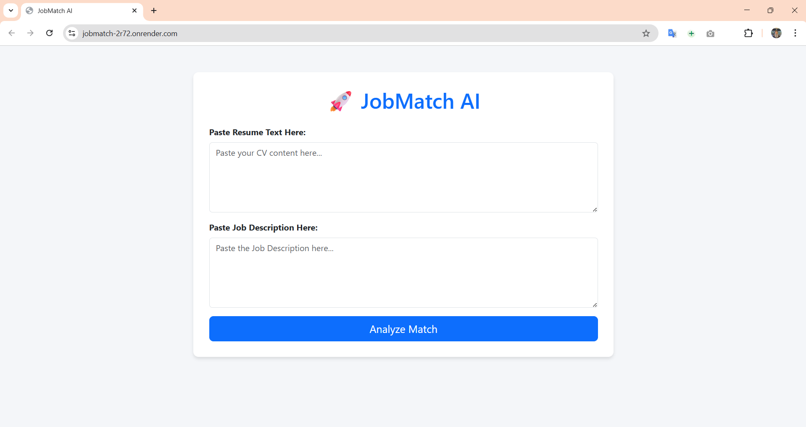

# 🚀 JobMatch AI - Intelligent Resume Optimizer


### **🔴 Live Demo:** [https://jobmatch-2r72.onrender.com](https://jobmatch-2r72.onrender.com)

---

## 📋 Project Overview

**JobMatch AI** is a smart career tool designed to help job seekers beat the **ATS (Applicant Tracking System)**.

We've all been there: You apply for a job you are perfect for, but you get rejected instantly because your resume didn't have the "right words." This tool acts as your **Personal AI Career Coach**. It uses **Generative AI (Llama 3 via Groq)** to analyze your resume against a specific job description and tells you exactly how to fix it.

**Key Highlight:** This system is built with **Spring Boot (Java)** for enterprise-grade performance and uses the **Groq LPU Engine** for lightning-fast AI analysis.

---

## 📸 Project Screenshot


*(Note: Upload a screenshot of your app to your repo and name it screenshot.png)*

---

## 🚀 Key Features

* **📊 Smart Match Score:** Instantly gives you a score (0-100%) based on how well your skills fit the job.
* **🔍 Keyword Gap Analysis:** Identifies critical technical skills missing from your resume (e.g., "You are missing: Docker, AWS").
* **✍️ AI Profile Rewriter:** Automatically rewrites your "Professional Summary" to sound more appealing to recruiters.
* **⚡ High-Speed Inference:** Powered by Groq, analysis takes less than 2 seconds.
* **📱 Responsive UI:** Built with Bootstrap, working smoothly on both mobile and desktop.

---

## 🛠️ Tech Stack

| Component | Technology Used | Why? |
| :--- | :--- | :--- |
| **Backend** | Java 21 + Spring Boot | Robust, scalable, and industry-standard for enterprise apps. |
| **AI Engine** | Groq (Llama-3.3-70b) | The fastest inference API on the market (Free tier). |
| **Frontend** | Thymeleaf + Bootstrap | Clean, server-side rendering with responsive design. |
| **Deployment** | Docker + Render | Containerized deployment for easy cloud hosting. |
| **Build Tool** | Maven | Standard dependency management for Java. |

---

## ⚙️ How It Works (Logic Flow)

1.  **Input:** User pastes their **Resume Text** and the **Target Job Description**.
2.  **Data Handling:** The Spring Boot Controller packs this data into a secure `MatchRequest` object.
3.  **Prompt Engineering:** The Service Layer wraps the data in a strict system prompt:
    > *"You are an expert Career Coach. Analyze these two texts, give a score, list missing keywords, and rewrite the summary..."*
4.  **AI Processing:** The request is sent to **Groq Cloud**, processed by **Llama 3**, and returned in milliseconds.
5.  **Output:** The website displays the formatted advice to the user.

---

## 📦 How to Run This Project Locally

### Prerequisites
* **Java 21 (JDK)** installed.
* **Maven** installed.
* A free **Groq API Key** (Get it [here](https://console.groq.com/keys)).

### Installation Steps

1.  **Clone the Repository**
    ```bash
    git clone [https://github.com/Subhaga2000/jobmatch.git](https://github.com/Subhaga2000/jobmatch.git)
    cd jobmatch
    ```

2.  **Configure API Key**
    * Open `src/main/resources/application.properties`.
    * Find the line `${GROQ_API_KEY}`.
    * **Option A (Safe):** Set an Environment Variable on your PC named `GROQ_API_KEY`.
    * **Option B (Quick):** Replace `${GROQ_API_KEY}` with your actual key (Do not commit this to GitHub!).

3.  **Run the Application**
    ```bash
    mvn spring-boot:run
    ```

4.  **Access the App**
    * Open your browser and go to: `http://localhost:8080`

---

## 🔮 Future Enhancements

* [ ] **PDF Upload:** Allow users to upload PDF files directly instead of pasting text.
* [ ] **History Tab:** Save previous analyses using a database (MySQL).
* [ ] **Cover Letter Generator:** Add a button to generate a full cover letter based on the match.
* [ ] **User Login:** Save user profiles and multiple resumes.

---

## 👨‍💻 Author

**Built by Subhaga Hansamana**

* **GitHub:** [Subhaga2000](https://github.com/Subhaga2000)
* **University:** SLTC Research University
